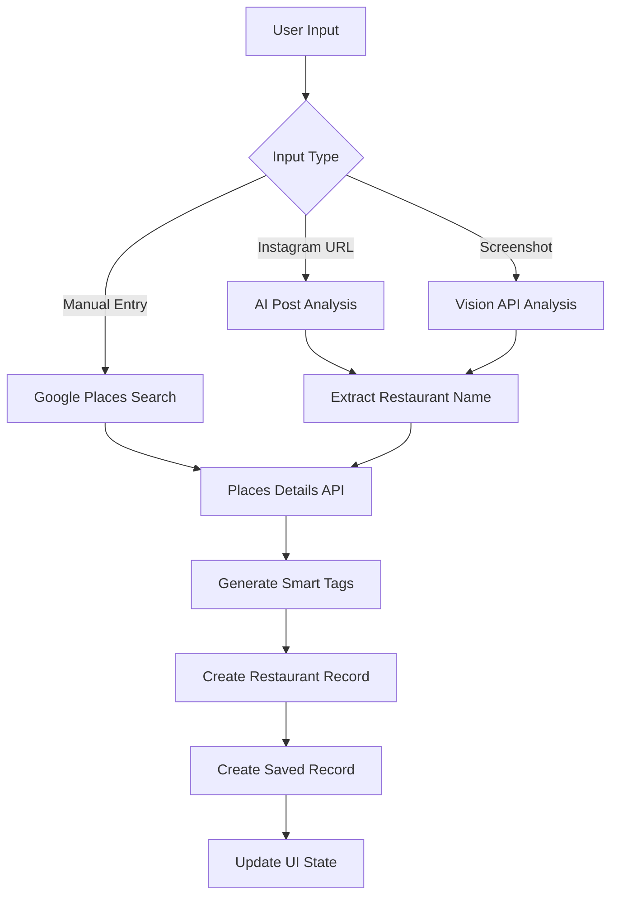
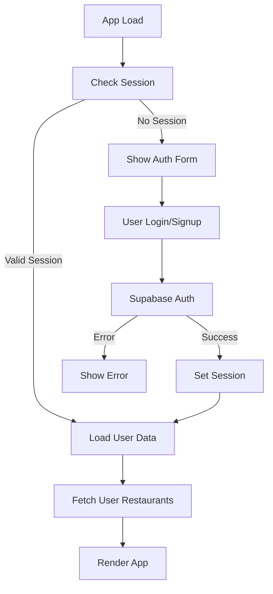

# Haze v2 - Technical Architecture Documentation 🏗️

## 🎯 **SYSTEM OVERVIEW**

Haze is a modern web application built with React that enables users to discover, save, and organize restaurants from Instagram posts using AI-powered extraction and Google Places integration. The architecture prioritizes mobile-first experience, real-time data, and seamless AI integration.

### **High-Level Architecture**

```
┌─────────────────┐    ┌──────────────────┐    ┌─────────────────┐
│   Frontend      │    │   Backend APIs   │    │   External APIs │
│   React + Vite  │◄──►│   Supabase       │◄──►│   OpenAI        │
│                 │    │   PostgreSQL     │    │   Google Maps   │
│                 │    │   Auth + RLS     │    │   Google Places │
└─────────────────┘    └──────────────────┘    └─────────────────┘
         │                       │                       │
         ▼                       ▼                       ▼
┌─────────────────┐    ┌──────────────────┐    ┌─────────────────┐
│   Deployment    │    │   Data Storage   │    │   AI Processing │
│   Netlify CDN   │    │   JSONB Schema   │    │   GPT-4o Vision │
│   Auto Deploy   │    │   Real-time Sync │    │   Tag Generation│
└─────────────────┘    └──────────────────┘    └─────────────────┘
```

---

## 🏛️ **FRONTEND ARCHITECTURE**

### **Technology Stack**

| Component | Technology | Version | Purpose |
|-----------|------------|---------|---------|
| **Framework** | React | 18.2.0 | Component-based UI |
| **Build Tool** | Vite | 5.4.19 | Fast development and building |
| **Language** | JavaScript ES6+ | Latest | Modern JS features |
| **Styling** | CSS-in-JS + CSS Modules | - | Component-scoped styling |
| **State Management** | React Hooks | Built-in | Local and global state |
| **HTTP Client** | Fetch API | Native | API communications |
| **Maps** | Google Maps JavaScript API | v3 | Interactive mapping |
| **PWA** | Service Worker + Manifest | - | Offline capabilities |

### **Component Architecture**

```
src/
├── App.jsx                     # Root component with auth
├── main.jsx                    # App initialization
├── index.css                   # Global styles
├── App.css                     # Component styles
└── components/
    ├── Auth.jsx                # Authentication flow
    ├── RestaurantApp.jsx       # Main app container
    ├── BottomNavigation.jsx    # Tab navigation
    ├── BottomSheet.jsx         # Modal system
    ├── RestaurantList.jsx      # Restaurant listing
    ├── RestaurantDetail.jsx    # Restaurant details
    ├── MapView.jsx             # Google Maps integration
    ├── InstagramImporter.jsx   # Multi-method restaurant addition
    ├── SearchAndFilter.jsx     # Search functionality
    ├── DiscoverTab.jsx         # Discovery features
    └── ProfileTab.jsx          # User profile
```

### **State Management Pattern**

```javascript
// Parent Component (RestaurantApp.jsx)
const [restaurants, setRestaurants] = useState([])
const [filteredRestaurants, setFilteredRestaurants] = useState([])
const [activeTab, setActiveTab] = useState('list')

// Child Components receive props and callbacks
<RestaurantList 
  restaurants={filteredRestaurants}
  onRestaurantUpdate={handleRestaurantUpdate}
  onRestaurantDelete={handleRestaurantDelete}
/>

// State flows down, events flow up
const handleRestaurantUpdate = (updatedRec) => {
  setRestaurants(prev => prev.map(rec => 
    rec.id === updatedRec.id ? updatedRec : rec
  ))
}
```

### **Routing Strategy**

- **Single Page Application (SPA)**: No client-side routing library
- **Tab-based Navigation**: State-driven tab switching
- **Modal System**: Bottom sheets for detail views
- **Deep Linking**: URL parameters for shared restaurant links (future)

---

## 🗄️ **DATABASE ARCHITECTURE**

### **Supabase PostgreSQL Schema**

```sql
-- User authentication (managed by Supabase Auth)
auth.users
├── id (uuid, primary key)
├── email (text, unique)
├── created_at (timestamp)
└── updated_at (timestamp)

-- Restaurant master data
public.restaurants
├── id (uuid, primary key, default: gen_random_uuid())
├── name (text, not null)
├── address (text, nullable)
├── latitude (float8, nullable)
├── longitude (float8, nullable)
├── phone (text, nullable)
├── website (text, nullable)
├── rating (float4, nullable)           -- Google Places rating
├── price_level (integer, nullable)     -- 1-4 scale
├── hours (jsonb, nullable)             -- Opening hours object
├── google_place_id (text, nullable, unique)
├── created_at (timestamp with time zone, default: now())
└── updated_at (timestamp with time zone, default: now())

-- User's saved restaurants with personal data
public.saved_recs
├── id (uuid, primary key, default: gen_random_uuid())
├── user_id (uuid, not null, references auth.users(id))
├── restaurant_id (uuid, not null, references restaurants(id))
├── user_notes (text, nullable)
├── tags (text[], nullable)
├── source_type (text, not null)        -- 'instagram' | 'manual' | 'screenshot'
├── source_url (text, nullable)         -- Original Instagram URL
├── source_data (jsonb, nullable)       -- Enhanced data and metadata
├── created_at (timestamp with time zone, default: now())
└── updated_at (timestamp with time zone, default: now())

-- Indexes for performance
CREATE INDEX idx_saved_recs_user_id ON saved_recs(user_id);
CREATE INDEX idx_saved_recs_restaurant_id ON saved_recs(restaurant_id);
CREATE INDEX idx_restaurants_google_place_id ON restaurants(google_place_id);
CREATE INDEX idx_saved_recs_tags ON saved_recs USING GIN(tags);
CREATE INDEX idx_saved_recs_source_data ON saved_recs USING GIN(source_data);
```

### **Row Level Security (RLS) Policies**

```sql
-- Users can only access their own saved restaurants
CREATE POLICY "Users can view own saved_recs" ON saved_recs
  FOR SELECT USING (auth.uid() = user_id);

CREATE POLICY "Users can insert own saved_recs" ON saved_recs
  FOR INSERT WITH CHECK (auth.uid() = user_id);

CREATE POLICY "Users can update own saved_recs" ON saved_recs
  FOR UPDATE USING (auth.uid() = user_id);

CREATE POLICY "Users can delete own saved_recs" ON saved_recs
  FOR DELETE USING (auth.uid() = user_id);

-- Restaurants table is readable by all authenticated users
CREATE POLICY "Authenticated users can view restaurants" ON restaurants
  FOR SELECT TO authenticated USING (true);

CREATE POLICY "Authenticated users can insert restaurants" ON restaurants
  FOR INSERT TO authenticated WITH CHECK (true);
```

### **JSONB Data Structures**

#### **source_data Field Structure**

```json
{
  "photos": [
    {
      "url": "https://maps.googleapis.com/maps/api/place/photo?...",
      "width": 400,
      "height": 400
    }
  ],
  "reviews": [
    {
      "rating": 5,
      "text": "Amazing food and great service!",
      "author": "John D.",
      "time": "a week ago"
    }
  ],
  "types": ["restaurant", "food", "establishment"],
  "confidence": "high",
  "extraction_method": "instagram-ai",
  "sentiment": "positive",
  "mentions": ["great vibes", "must try"],
  "ai_analysis": {
    "cuisine_detected": "Italian",
    "price_prediction": "moderate",
    "occasion_tags": ["date night", "casual dining"]
  }
}
```

#### **hours Field Structure**

```json
{
  "weekdayText": [
    "Monday: 11:00 AM – 10:00 PM",
    "Tuesday: 11:00 AM – 10:00 PM",
    "Wednesday: 11:00 AM – 10:00 PM",
    "Thursday: 11:00 AM – 10:00 PM",
    "Friday: 11:00 AM – 11:00 PM",
    "Saturday: 10:00 AM – 11:00 PM",
    "Sunday: 10:00 AM – 9:00 PM"
  ],
  "openNow": true
}
```

---

## 🔌 **API INTEGRATIONS**

### **Supabase Client Configuration**

```javascript
// src/main.jsx
import { createClient } from '@supabase/supabase-js'

const supabaseUrl = import.meta.env.VITE_SUPABASE_URL
const supabaseKey = import.meta.env.VITE_SUPABASE_ANON_KEY

export const supabase = createClient(supabaseUrl, supabaseKey, {
  auth: {
    autoRefreshToken: true,
    persistSession: true,
    detectSessionInUrl: true
  }
})
```

### **OpenAI GPT-4o Integration**

#### **Instagram Post Analysis**

```javascript
const analyzeInstagramPost = async (instagramUrl, restaurantName) => {
  const response = await fetch('https://api.openai.com/v1/chat/completions', {
    method: 'POST',
    headers: {
      'Content-Type': 'application/json',
      'Authorization': `Bearer ${import.meta.env.VITE_OPENAI_API_KEY}`
    },
    body: JSON.stringify({
      model: 'gpt-3.5-turbo',
      messages: [
        {
          role: 'system',
          content: 'Analyze Instagram posts about restaurants. Extract personal context, sentiment, and generate relevant tags.'
        },
        {
          role: 'user',
          content: `Analyze why someone would save ${restaurantName} from: ${instagramUrl}`
        }
      ],
      max_tokens: 200,
      temperature: 0.3
    })
  })
  
  const data = await response.json()
  return JSON.parse(data.choices[0].message.content)
}
```

#### **Screenshot Analysis with Vision API**

```javascript
const analyzeScreenshot = async (imageFile) => {
  const base64Image = await fileToBase64(imageFile)
  
  const response = await fetch('https://api.openai.com/v1/chat/completions', {
    method: 'POST',
    headers: {
      'Content-Type': 'application/json',
      'Authorization': `Bearer ${import.meta.env.VITE_OPENAI_API_KEY}`
    },
    body: JSON.stringify({
      model: 'gpt-4o',
      messages: [
        {
          role: 'system',
          content: 'Extract restaurant information from Instagram screenshots...'
        },
        {
          role: 'user',
          content: [
            { type: 'text', text: 'Analyze this Instagram screenshot...' },
            {
              type: 'image_url',
              image_url: { url: `data:image/jpeg;base64,${base64Image}` }
            }
          ]
        }
      ],
      max_tokens: 300,
      temperature: 0.1
    })
  })
  
  return await response.json()
}
```

### **Google Maps & Places Integration**

#### **Maps JavaScript API**

```javascript
// Load Google Maps API dynamically
const loadGoogleMaps = () => {
  return new Promise((resolve, reject) => {
    if (window.google) {
      resolve(window.google)
      return
    }
    
    const script = document.createElement('script')
    script.src = `https://maps.googleapis.com/maps/api/js?key=${apiKey}&libraries=places`
    script.async = true
    script.defer = true
    script.onload = () => resolve(window.google)
    script.onerror = reject
    document.head.appendChild(script)
  })
}

// Initialize map with custom styling
const initMap = (mapElement, restaurants) => {
  const map = new google.maps.Map(mapElement, {
    zoom: 12,
    center: { lat: 40.7128, lng: -74.0060 }, // NYC default
    styles: [
      // Custom map styling for clean appearance
      {
        featureType: 'poi',
        elementType: 'labels',
        stylers: [{ visibility: 'off' }]
      }
    ]
  })
  
  return map
}
```

#### **Places API Integration**

```javascript
// Google Places Autocomplete
const setupAutocomplete = (inputElement, onPlaceSelect) => {
  const autocomplete = new google.maps.places.Autocomplete(inputElement, {
    types: ['establishment'],
    componentRestrictions: { country: 'us' }
  })
  
  autocomplete.addListener('place_changed', () => {
    const place = autocomplete.getPlace()
    onPlaceSelect(place)
  })
}

// Places Details API
const getPlaceDetails = (placeId) => {
  return new Promise((resolve, reject) => {
    const service = new google.maps.places.PlacesService(
      document.createElement('div')
    )
    
    service.getDetails({
      placeId,
      fields: [
        'name', 'formatted_address', 'formatted_phone_number',
        'website', 'rating', 'price_level', 'geometry',
        'opening_hours', 'photos', 'reviews', 'types'
      ]
    }, (place, status) => {
      if (status === google.maps.places.PlacesServiceStatus.OK) {
        resolve(place)
      } else {
        reject(new Error(`Places API error: ${status}`))
      }
    })
  })
}
```

---

## 🔄 **DATA FLOW ARCHITECTURE**

### **Restaurant Addition Flow**



### **Authentication Flow**



### **Real-time Data Sync**

```javascript
// Subscribe to real-time changes
useEffect(() => {
  const subscription = supabase
    .channel('saved_recs_changes')
    .on('postgres_changes', {
      event: '*',
      schema: 'public',
      table: 'saved_recs',
      filter: `user_id=eq.${session.user.id}`
    }, (payload) => {
      handleRealtimeUpdate(payload)
    })
    .subscribe()
    
  return () => {
    subscription.unsubscribe()
  }
}, [session])
```

---

## 🎨 **UI/UX ARCHITECTURE**

### **Design System Components**

#### **BottomSheet Component**

```javascript
const BottomSheet = ({ open, onClose, defaultHeight, children }) => {
  const [height, setHeight] = useState(0)
  const [isDragging, setIsDragging] = useState(false)
  
  // Drag handling for resize functionality
  const handleDragStart = (e) => {
    setIsDragging(true)
    // Touch/mouse event handling
  }
  
  // Responsive height calculation
  useEffect(() => {
    if (open) {
      const vh = window.innerHeight
      const targetHeight = defaultHeight === 'full' ? vh * 0.85 : vh * 0.5
      setHeight(targetHeight)
    }
  }, [open, defaultHeight])
  
  return (
    <div className="bottom-sheet-overlay" onClick={handleOverlayClick}>
      <div 
        className="bottom-sheet"
        style={{ height: `${height}px` }}
        onMouseDown={handleDragStart}
        onTouchStart={handleDragStart}
      >
        <div className="drag-handle" />
        {children}
      </div>
    </div>
  )
}
```

#### **Responsive Design Strategy**

```css
/* Mobile-first approach */
.restaurant-detail-content {
  padding-left: 10px;
  padding-right: 10px;
}

/* Desktop enhancements */
@media (min-width: 768px) {
  .restaurant-detail-content {
    padding-left: 30px;
    padding-right: 30px;
  }
  
  .modal-overlay {
    align-items: center;
    padding: 20px;
  }
  
  .modal {
    border-radius: 12px;
    max-height: 90vh;
  }
}

/* iOS safe area support */
.restaurant-app {
  padding-bottom: calc(90px + env(safe-area-inset-bottom));
}
```

### **Performance Optimizations**

#### **Lazy Loading Strategy**

```javascript
// Lazy load Google Maps API
const MapView = lazy(() => import('./MapView'))

// Conditional rendering with Suspense
<Suspense fallback={<div>Loading map...</div>}>
  {activeTab === 'map' && <MapView restaurants={restaurants} />}
</Suspense>
```

#### **Image Optimization**

```javascript
// Google Places photo optimization
const optimizePhotoUrl = (photo, maxWidth = 400, maxHeight = 400) => {
  return photo.getUrl({ maxWidth, maxHeight })
}

// Lazy loading for restaurant images
const RestaurantImage = ({ src, alt }) => {
  const [loaded, setLoaded] = useState(false)
  
  return (
    <div className="image-container">
      {!loaded && <div className="image-skeleton" />}
       setLoaded(true)}
        style={{ display: loaded ? 'block' : 'none' }}
      />
    </div>
  )
}
```

---

## 🚀 **DEPLOYMENT ARCHITECTURE**

### **Netlify Configuration**

```toml
# netlify.toml
[build]
  command = "npm run build"
  publish = "dist"

[build.environment]
  NODE_VERSION = "18"

[[redirects]]
  from = "/*"
  to = "/index.html"
  status = 200

[[headers]]
  for = "/assets/*"
  [headers.values]
    Cache-Control = "public, max-age=31536000, immutable"
```

### **Environment Variables**

```bash
# Development (.env.local)
VITE_SUPABASE_URL=https://yfslnblnkwarykdobznf.supabase.co
VITE_SUPABASE_ANON_KEY=eyJ...
VITE_GOOGLE_MAPS_API_KEY=AIza...
VITE_OPENAI_API_KEY=sk-...

# Production (Netlify Environment Variables)
# Same variables set through Netlify dashboard
# Automatically injected during build process
```

### **Build Optimization**

```javascript
// vite.config.js
import { defineConfig } from 'vite'
import react from '@vitejs/plugin-react'

export default defineConfig({
  plugins: [react()],
  build: {
    rollupOptions: {
      output: {
        manualChunks: {
          vendor: ['react', 'react-dom'],
          maps: ['@googlemaps/js-api-loader'],
          supabase: ['@supabase/supabase-js']
        }
      }
    },
    chunkSizeWarningLimit: 1000
  },
  server: {
    port: 5173,
    host: true
  }
})
```

---

## 🔒 **SECURITY ARCHITECTURE**

### **Authentication & Authorization**

```javascript
// Supabase Auth configuration
const authConfig = {
  autoRefreshToken: true,
  persistSession: true,
  detectSessionInUrl: true,
  flowType: 'pkce' // Proof Key for Code Exchange
}

// Protected route pattern
const useAuthGuard = () => {
  const [session, setSession] = useState(null)
  const [loading, setLoading] = useState(true)
  
  useEffect(() => {
    // Get initial session
    supabase.auth.getSession().then(({ data: { session } }) => {
      setSession(session)
      setLoading(false)
    })
    
    // Listen for auth changes
    const { data: { subscription } } = supabase.auth.onAuthStateChange(
      (event, session) => {
        setSession(session)
      }
    )
    
    return () => subscription.unsubscribe()
  }, [])
  
  return { session, loading }
}
```

### **API Key Security**

```javascript
// Client-side API key validation
const validateApiKeys = () => {
  const requiredKeys = [
    'VITE_SUPABASE_URL',
    'VITE_SUPABASE_ANON_KEY',
    'VITE_GOOGLE_MAPS_API_KEY'
  ]
  
  const missing = requiredKeys.filter(key => !import.meta.env[key])
  
  if (missing.length > 0) {
    console.error('Missing required environment variables:', missing)
    return false
  }
  
  return true
}

// OpenAI API key protection
const isOpenAIConfigured = () => {
  return import.meta.env.VITE_OPENAI_API_KEY !== 'placeholder'
}
```

### **Data Validation & Sanitization**

```javascript
// Input sanitization for user data
const sanitizeUserInput = (input) => {
  if (typeof input !== 'string') return ''
  
  return input
    .trim()
    .replace(/<script\b[^<]*(?:(?!<\/script>)<[^<]*)*<\/script>/gi, '')
    .replace(/javascript:/gi, '')
    .substring(0, 1000) // Limit length
}

// Restaurant data validation
const validateRestaurantData = (data) => {
  const schema = {
    name: { required: true, type: 'string', maxLength: 200 },
    address: { required: false, type: 'string', maxLength: 500 },
    latitude: { required: false, type: 'number', min: -90, max: 90 },
    longitude: { required: false, type: 'number', min: -180, max: 180 }
  }
  
  return validateSchema(data, schema)
}
```

---

## 📊 **MONITORING & ANALYTICS**

### **Performance Monitoring**

```javascript
// Core Web Vitals tracking
const trackWebVitals = () => {
  import('web-vitals').then(({ getCLS, getFID, getFCP, getLCP, getTTFB }) => {
    getCLS(console.log)
    getFID(console.log)
    getFCP(console.log)
    getLCP(console.log)
    getTTFB(console.log)
  })
}

// Custom performance metrics
const trackRestaurantAddition = async (method, duration, success) => {
  console.log('Restaurant Addition:', {
    method,
    duration: `${duration}ms`,
    success,
    timestamp: new Date().toISOString()
  })
}
```

### **Error Handling Strategy**

```javascript
// Global error boundary
class ErrorBoundary extends React.Component {
  constructor(props) {
    super(props)
    this.state = { hasError: false, error: null }
  }
  
  static getDerivedStateFromError(error) {
    return { hasError: true, error }
  }
  
  componentDidCatch(error, errorInfo) {
    console.error('Error Boundary caught an error:', error, errorInfo)
    // Send to monitoring service in production
  }
  
  render() {
    if (this.state.hasError) {
      return <ErrorFallback error={this.state.error} />
    }
    
    return this.props.children
  }
}

// API error handling
const handleApiError = (error, context) => {
  const errorData = {
    message: error.message,
    stack: error.stack,
    context,
    timestamp: new Date().toISOString(),
    userAgent: navigator.userAgent
  }
  
  console.error('API Error:', errorData)
  
  // User-friendly error messages
  const userMessage = getUserFriendlyErrorMessage(error)
  return userMessage
}
```

---

## 🔮 **FUTURE ARCHITECTURE CONSIDERATIONS**

### **Scalability Preparations**

1. **Database Optimization**
   - Implement read replicas for geographic distribution
   - Add database connection pooling
   - Consider sharding strategies for large datasets

2. **Caching Layer**
   - Redis for Google Places API response caching
   - CDN integration for static assets
   - Service worker caching for offline functionality

3. **Microservices Migration**
   - Separate AI processing service
   - Dedicated image processing pipeline
   - API gateway for request routing and rate limiting

### **Performance Enhancements**

1. **Code Splitting**
   - Route-based code splitting
   - Component-level lazy loading
   - Dynamic imports for heavy libraries

2. **Image Optimization**
   - WebP format support with fallbacks
   - Progressive image loading
   - Responsive image sizing

3. **API Optimization**
   - GraphQL for efficient data fetching
   - Request batching and deduplication
   - Background sync for offline actions

---

This architecture documentation provides a comprehensive overview of the current technical implementation and serves as a foundation for future development and scaling decisions. The modular design and clear separation of concerns enable rapid iteration while maintaining code quality and performance. 